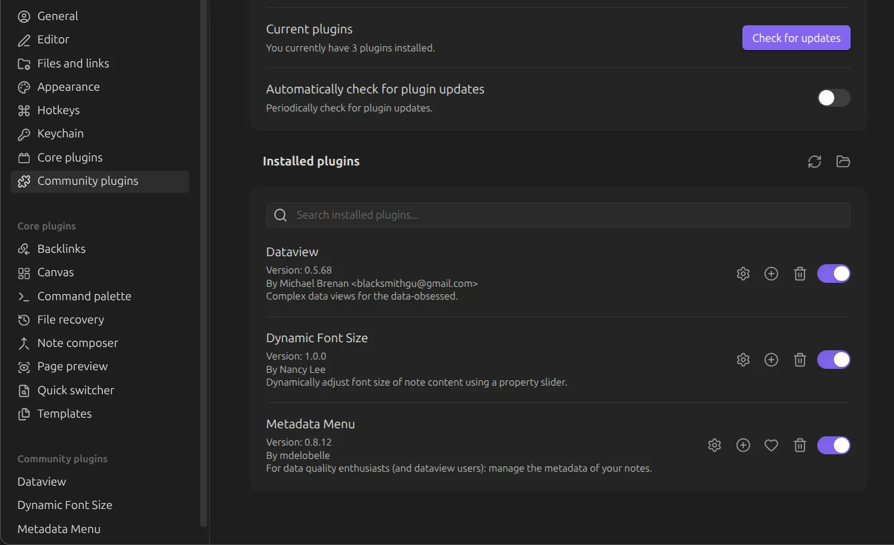
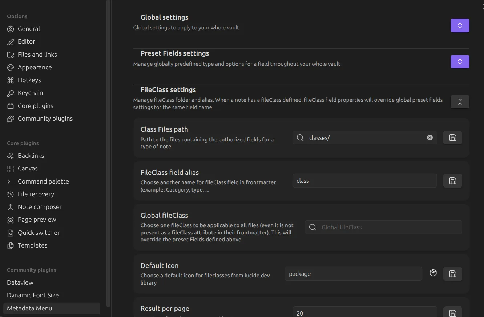
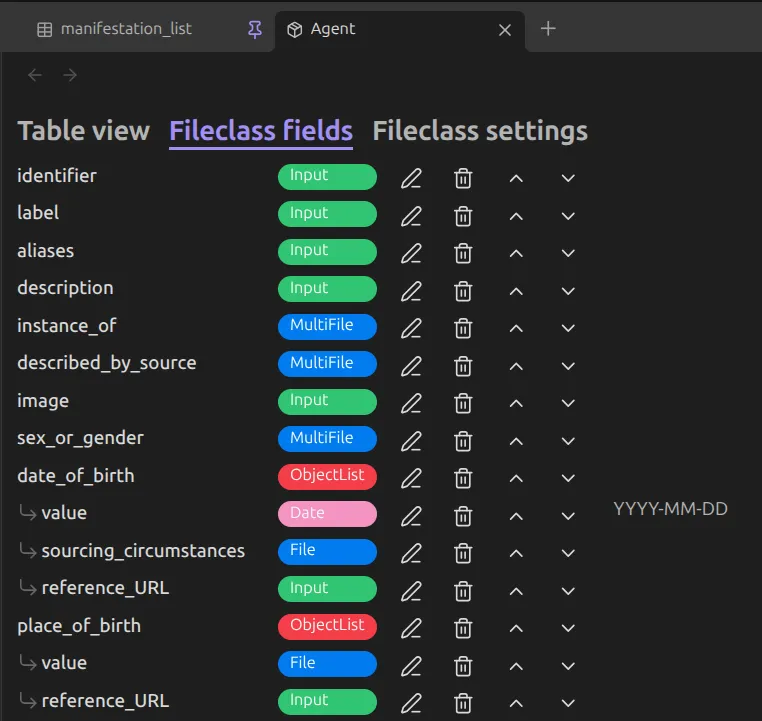

# Tutorials

## Design your Data Model

1. Define classes
2. Define statements

## Setting up your Obsidian vault

There are several tutorials available on the web in order to help you setting up your Obsidian vault and Metadata Menu. Here you can find some basic steps:

1. Create a new empty vault.
2. Activate community plugins
- Enable [Metadata Menu](https://mdelobelle.github.io/metadatamenu/) plugin.

3. Set up the `classes` folder in the Metadata Menu. 

4. Built property structure for each class via Metadata Menu. There are several types available, such as `File` and `MultiFile` for internal wikilinks notes, `ObjectList` for nested statements (recommended if you are planning to include references and qualifiers), and simple strings as `Input`.

### Dealing with older Obsidian vaults

> Can I use my old Obsidian notes without Metadata Menu? 

Yes, but you should add a `class` property to your note. This can be done programmatically via tags or other property values.

If you don't have any class, the software will by default define the entity as [Thing](https://schema.org/Thing).

> How do I store assets related to a note?

Create a new property called `local_asset_path` and provide the relative path to the folder in your vault where the assets are stored. Make sure there are no subdirectories, all assets are on the same depth. We advice to create an `assets` folder inside your vault for all assets.
